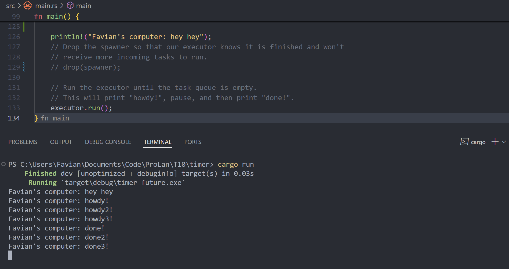
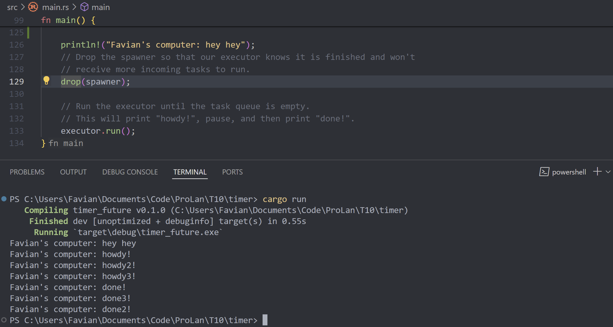
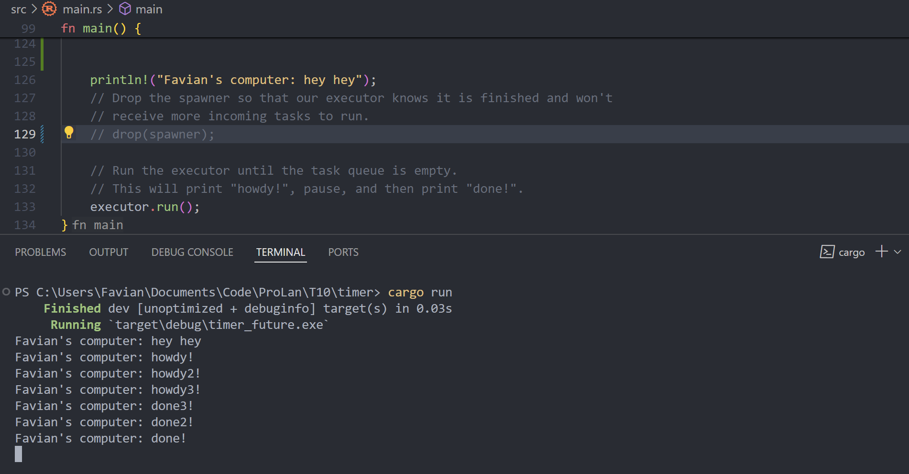

# Tutorial 10 - Timer

Favian Naufal - **2006597802**

## Information
This tutorial is based on the part of the Rust asynchronous book:  
https://rust-lang.github.io/async-book/02_execution/04_executor.html

To run the program:
- Clone this repository: `git clone https://github.com/Sylphiann/T10-Timer.git`
- Navigate into the codebase, for windows: `cd T10-Timer`
- Run the program: `cargo run`

## Reflection
### **Experiment 1.2: Understanding how it works**   

From what we can see, the message `hey hey` was printed first ahead of the rest, this implies that this message wasn't within the scope of the executor block, and was run before the executor itself. When the executor was run, then it would print the message `howdy!`, along with the future which resolves themselves for 2 seconds using `TimerFuture` and print the last message `done!`.
---

### **Experiment 1.3: Multiple Spawn and removing drop**   

---

---

---
When the line `drop(spawner)` was removed from the program (or in this case, turned into a comment), the executor won't know when it would be finished and would wait to receive more incoming tasks. Thus that's what the like `drop(spawner)` does, it stops the spawner as it tells the executor that it was finished and won't receive any more incoming messages, as it was shown in the second image compared to the first image. The third image shows the behavior of an asynchronous trait where each executor block executes whoever finishes first, resulting in an inconsistent order of print of the `done!` message.