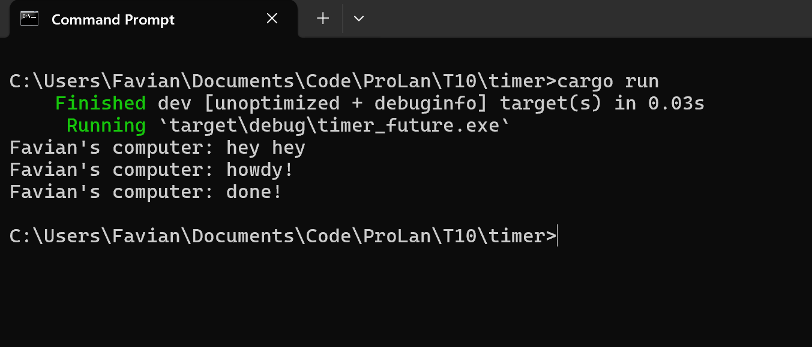

# Tutorial 10 - Timer

Favian Naufal - **2006597802**

## Information
This tutorial is based on the part of the Rust asynchronous book:  
https://rust-lang.github.io/async-book/02_execution/04_executor.html

To run the program:
- Clone this repository: `git clone https://github.com/Sylphiann/T10-Timer.git`
- Navigate into the codebase, for windows: `cd T10-Timer`
- Run the program: `cargo run`

## Reflection
**Experiment 1.2: Understanding how it works**   

From what we can see, the message `hey hey` was printed first ahead of the rest, this implies that this message wasn't within the scope of the executor block, and was run before the executor itself. When the executor was run, then it would print the message `howdy!`, along with the future which resolves themselves for 2 seconds using `TimerFuture` and print the last message `done!`.